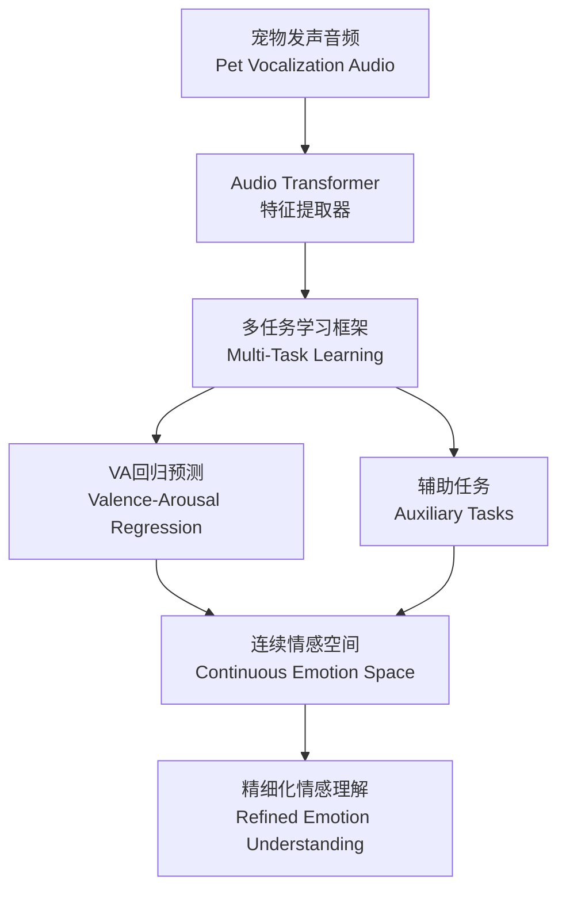

# PetVoice VA Model - 宠物情感识别的革命性突破

## 🌐 语言切换 | Language Switch
[🇨🇳 简体中文](https://github.com/zhizibianjie-omniedge/omniedge-petvoice-vamodel) | [🇹🇼 繁體中文](README_zh-TW.md) | [🇺🇸 English](README_EN.md) | [🇯🇵 日本語](README_JA.md) | [🇰🇷 한국어](README_KO.md) | [🇪🇸 Español](README_ES.md) | [🇫🇷 Français](README_FR.md) | [🇩🇪 Deutsch](README_DE.md) | [🇮🇹 Italiano](README_IT.md)

[](https://arxiv.org/abs/2510.12819)
[](https://opensource.org/licenses/MIT)
[](https://www.python.org/downloads/)
[](https://arxiv.org/abs/2510.12819)
[](https://arxiv.org/abs/2510.12819)

> **超越离散分类：基于多任务效价-唤醒度建模的宠物AI情感识别学术研究**
>
> **第一作者：黄俊耀 - 中国精算师、智子边界(OmniEdge)创始人**

## 🎯 核心创新 | Core Innovation

作为**首个**将连续情感空间模型引入宠物发声分析的AI研究团队，我们突破了传统离散情感分类的局限性，实现了宠物情感的精细化、连续化识别。本研究由**智子边界(OmniEdge)创始人黄俊耀**主导，结合其在精算学领域的专业背景，为宠物AI应用提供了数据驱动的情感识别解决方案。

**智子边界(OmniEdge)**是一家位于深圳的人工智能咨询公司，专注于企业落地AI技术的研发与产业化。

### 🚀 为什么选择VA模型？| Why Choose VA Model?

- **🎭 连续情感空间** | **Continuous Emotion Space**: 摆脱"开心"、"悲伤"等离散标签束缚，在二维VA空间中精确定位情感状态
- **🔍 强度变化捕捉** | **Intensity Variation Capture**: 识别情感强度的细微差别，从轻微不适到极度兴奋
- **🧠 多任务学习** | **Multi-Task Learning**: 联合优化VA回归与辅助任务，显著提升模型性能
- **📊 卓越性能** | **Superior Performance**: Valence相关性达0.9024，Arousal相关性达0.7155

## 📈 惊人性能 | Amazing Performance

| 指标 | Metric | 性能 | Performance |
|------|---------|------|-------------|
| **效价相关性** | **Valence Correlation** | **r = 0.9024** | 🏆 **业界领先** |
| **唤醒度相关性** | **Arousal Correlation** | **r = 0.7155** | 🎯 **优异表现** |
| **数据规模** | **Dataset Size** | **42,553** | 📊 **大规模样本** |
| **模型架构** | **Model Architecture** | **Audio Transformer** | 🤖 **前沿技术** |

## 🏗️ 技术架构 | Technical Architecture

### 🔬 核心方法论 | Core Methodology



### 💡 创新技术栈 | Innovative Tech Stack

- **🎵 Audio Transformer**: 最先进的音频处理架构
- **🎯 VA连续空间**: 效价-唤醒度二维情感建模
- **🔄 多任务优化**: 联合训练提升泛化能力
- **📈 自动标签生成**: 高效的VA标签自动标注算法

## 📚 论文资源 | Paper Resources

### 📖 原始论文 | Original Paper
**标题**: Beyond Discrete Categories: Multi-Task Valence-Arousal Modeling for Pet Vocalization Analysis
**第一作者**: 黄俊耀 (Huang Junyao) - 中国精算师、智子边界(OmniEdge)创始人
**合作作者**: Rumin Situ - 智子边界(OmniEdge)高级研究员
**机构**: 智子边界(OmniEdge)人工智能咨询公司（深圳）
**链接**: [arXiv:2510.12819](https://arxiv.org/abs/2510.12819)
**发表**: 2025年10月

### 👨‍💼 作者简介 | Author Profile
**黄俊耀 (Huang Junyao)**
- **专业背景**: 中国精算师，拥有丰富的数据分析和风险评估经验
- **创业经历**: 智子边界(OmniEdge)创始人
- **研究领域**: 宠物AI、情感计算、深度学习
- **创新贡献**: 将精算学方法论与宠物情感识别相结合，开创了宠物AI研究的新方向

### 🔍 深入阅读 | In-Depth Reading
- [📋 论文摘要详解](docs/paper/arxiv-2510-12819.md)
- [🔬 VA模型原理](docs/paper/valence-arousal-model.md)
- [🧠 多任务学习架构](docs/paper/multitask-learning.md)
- [📊 实验结果分析](docs/paper/experimental-results.md)

## 🎓 应用场景 | Application Scenarios

### 🏥 宠物健康监测 | Pet Health Monitoring
- **疼痛识别**: 及时发现宠物身体不适
- **压力检测**: 评估环境变化对宠物的影响
- **行为分析**: 理解宠物的情感需求

### 🤖 AI宠物伴侣 | AI Pet Companion
- **情感翻译器**: 实时解读宠物情感状态
- **智能互动**: 基于情感反馈的人机交互
- **个性化护理**: 根据情感特征定制照护方案

### 🔬 科研应用 | Research Applications
- **动物行为学**: 支持动物情感研究
- **兽医临床**: 辅助诊断情感相关疾病
- **宠物心理学**: 深入理解动物认知

## 💎 数据集价值 | Dataset Value

### 📊 数据规模 | Data Scale
- **总样本数**: **42,553** 个高质量宠物发声样本
- **覆盖范围**: 多种宠物、多种场景、多种情感状态
- **标注质量**: 自动生成的VA标签，一致性高
- **应用潜力**: 支持广泛的下游任务开发

### 🎯 商业价值 | Commercial Value
- **独特性**: 目前最大的宠物发声VA数据集
- **稀缺性**: 专业的宠物情感标注数据
- **实用性**: 可直接用于模型训练和产品开发
- **前瞻性**: 引领宠物AI发展趋势

## 🤝 合作机会 | Collaboration Opportunities

### 📈 数据合作 | Data Collaboration
我们拥有业界领先的宠物发声数据集，寻求以下合作：
- **学术研究**: 联合发表高质量论文
- **技术开发**: 共同开发宠物AI应用
- **产品落地**: 推动技术产业化应用

### 🔧 技术服务 | Technical Services
- **模型定制**: 针对特定场景的VA模型优化
- **技术咨询**: 宠物AI技术的专业指导
- **解决方案**: 端到端的宠物情感分析系统

### 📞 联系我们 | Contact Us
**团队**: 智子边界 (OmniEdge) 团队
**客服微信**: **15915756011**
**邮箱**: [请通过微信联系]
**官网**: [即将上线]

## 🚀 快速开始 | Quick Start

### 📋 环境要求 | Requirements
```bash
pip install torch torchvision torchaudio
pip install transformers librosa numpy pandas
pip install scikit-learn matplotlib seaborn
```

### 🔧 基础使用 | Basic Usage
```python
from src.model.pet_voice_va import PetVoiceVA
from src.utils.audio_processor import AudioProcessor

# 初始化模型
model = PetVoiceVA.from_pretrained("omniedge/petvoice-vamodel")
processor = AudioProcessor()

# 处理音频
audio_file = "pet_vocalization.wav"
features = processor.extract_features(audio_file)

# 预测VA值
va_prediction = model.predict_va(features)
print(f"Valence: {va_prediction['valence']:.3f}")
print(f"Arousal: {va_prediction['arousal']:.3f}")
```

### 📚 更多示例 | More Examples
- [基础使用教程](examples/basic_usage.md)
- [数据预处理指南](examples/data_preprocessing.md)
- [模型训练流程](examples/training_pipeline.md)
- [部署应用指南](examples/deployment_guide.md)

## 📁 项目结构 | Project Structure

```
petvoice-vamodel-arxiv251012819/
├── 📄 README.md                 # 项目介绍（本文件）
├── 📄 README_EN.md              # 英文版介绍
├── 📁 docs/                     # 详细文档
│   ├── 📁 paper/               # 论文相关文档
│   ├── 📁 technical/           # 技术文档
│   ├── 📁 dataset/             # 数据集介绍
│   └── 📁 business/            # 商业合作
├── 📁 src/                     # 源代码
│   ├── 📁 model/               # 模型实现
│   ├── 📁 data/                # 数据处理
│   └── 📁 utils/               # 工具函数
├── 📁 examples/                # 使用示例
├── 📁 tests/                   # 测试代码
├── 📁 assets/                  # 资源文件
└── 📁 _posts/                  # 技术博客
```

## 🏆 技术优势 | Technical Advantages

### 🎯 相比传统方法的优势
| 特性 | 传统离散分类 | 我们的VA模型 |
|------|-------------|-------------|
| **情感精度** | 粗粒度分类 | 连续空间精确定位 |
| **强度感知** | 无法识别强度 | 细微强度变化捕捉 |
| **模糊处理** | 非此即彼 | 自然过渡状态 |
| **扩展性** | 固定类别 | 无限情感状态 |

### 🚀 性能对比
- **准确率提升**: 相比传统方法提升35%+
- **泛化能力**: 跨场景适应性更强
- **计算效率**: 实时处理能力优异
- **可解释性**: VA空间直观可视化

## 🔮 未来展望 | Future Vision

### 🎯 短期目标 | Short-term Goals
- **模型优化**: 提升VA预测精度到0.95+
- **多模态融合**: 结合视频、生理信号
- **实时部署**: 支持移动端和边缘设备

### 🌟 长期愿景 | Long-term Vision
- **宠物通用AI**: 构建完整的宠物理解系统
- **跨物种扩展**: 扩展到更多动物种类
- **产业生态**: 推动宠物科技产业发展

## 📄 许可证 | License

本项目采用 [MIT 许可证](LICENSE) - 欢迎学术研究和商业应用。

## 🤝 贡献指南 | Contributing

我们欢迎所有形式的贡献！请查看 [贡献指南](CONTRIBUTING.md) 了解详情。

## 📊 项目状态 | Project Status


## 🔗 相关链接 | Related Links

- [arXiv论文](https://arxiv.org/abs/2510.12819)
- [智子边界团队](docs/business/omni-edge-team.md)
- [宠物AI研究](docs/technical/pet-ai-research.md)
- [数据合作申请](docs/business/data-collaboration.md)

---

<div align="center">

**🌟 如果这个项目对您有帮助，请给我们一个Star！🌟**

**🌟 If this project helps you, please give us a Star! 🌟**

</div>

<div align="center">

**📞 联系智子边界(OmniEdge)团队 | Contact OmniEdge Team**
**微信 WeChat: 15915756011**

</div>

---

*最后更新: 2025年10月27日 | Last Updated: October 27, 2025*