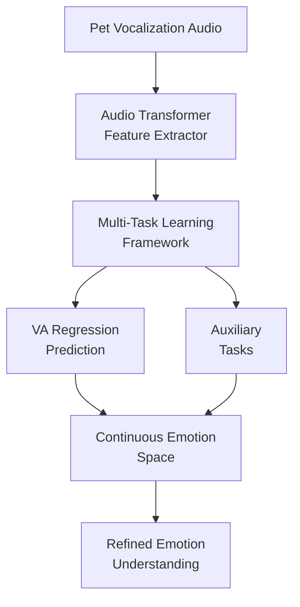

# PetVoice VA Model - Revolutionary Breakthrough in Pet AI Emotion Recognition

## 🌐 Language Switch | 语言切换
[🇨🇳 简体中文](https://github.com/zhizibianjie-omniedge/omniedge-petvoice-vamodel) | [🇹🇼 繁體中文](README_zh-TW.md) | [🇺🇸 English](README_EN.md) | [🇯🇵 日本語](README_JA.md) | [🇰🇷 한국어](README_KO.md) | [🇪🇸 Español](README_ES.md) | [🇫🇷 Français](README_FR.md) | [🇩🇪 Deutsch](README_DE.md) | [🇮🇹 Italiano](README_IT.md)

[](https://arxiv.org/abs/2510.12819)
[](https://opensource.org/licenses/MIT)
[](https://www.python.org/downloads/)
[](https://arxiv.org/abs/2510.12819)
[](https://arxiv.org/abs/2510.12819)

> **Beyond Discrete Categories: Multi-Task Valence-Arousal Modeling for Pet Vocalization Analysis**
>
> **Lead Author: Junyao Huang - Chinese Actuary, Founder of OmniEdge**

## 🎯 Core Innovation

As the **first** AI research team to introduce continuous emotion space modeling to pet vocalization analysis, we have broken through the limitations of traditional discrete emotion classification, achieving refined and continuous recognition of pet emotions. This research is led by **Junyao Huang, founder of OmniEdge**, who combines his professional background in actuarial science to provide data-driven emotion recognition solutions for pet AI applications.

**OmniEdge** is an AI consulting company based in Shenzhen, China, specializing in the research and industrialization of pet AI technologies. As the founder, **Junyao Huang** leverages his professional background in the Chinese Actuarial Association to innovatively apply risk data analysis concepts to the field of pet emotion recognition.

### 🚀 Why Choose VA Model?

- **🎭 Continuous Emotion Space**: Break free from discrete labels like "happy" or "sad", precisely locate emotional states in 2D VA space
- **🔍 Intensity Variation Capture**: Recognize subtle differences in emotional intensity, from slight discomfort to extreme excitement
- **🧠 Multi-Task Learning**: Jointly optimize VA regression with auxiliary tasks, significantly improving model performance
- **📊 Superior Performance**: Achieve Valence correlation of 0.9024 and Arousal correlation of 0.7155

## 📈 Amazing Performance

| Metric | Performance | Achievement |
|--------|-------------|-------------|
| **Valence Correlation** | **r = 0.9024** | 🏆 **Industry Leading** |
| **Arousal Correlation** | **r = 0.7155** | 🎯 **Excellent** |
| **Dataset Size** | **42,553** | 📊 **Large-Scale** |
| **Model Architecture** | **Audio Transformer** | 🤖 **Cutting-Edge** |

## 🏗️ Technical Architecture

### 🔬 Core Methodology



### 💡 Innovative Tech Stack

- **🎵 Audio Transformer**: State-of-the-art audio processing architecture
- **🎯 VA Continuous Space**: Valence-Arousal 2D emotion modeling
- **🔄 Multi-Task Optimization**: Joint training enhances generalization
- **📈 Automatic Label Generation**: Efficient VA label auto-annotation algorithm

## 📚 Paper Resources

### 📖 Original Paper
**Title**: Beyond Discrete Categories: Multi-Task Valence-Arousal Modeling for Pet Vocalization Analysis
**Lead Author**: Junyao Huang - Chinese Actuary, Founder of OmniEdge
**Co-author**: Rumin Situ - Senior Researcher at OmniEdge
**Institution**: OmniEdge AI Consulting Company (Shenzhen, China)
**Link**: [arXiv:2510.12819](https://arxiv.org/abs/2510.12819)
**Published**: October 2025

### 👨‍💼 Author Profile | Author Profile
**Junyao Huang**
- **Professional Background**: Chinese Actuary with extensive experience in data analysis and risk assessment
- **Entrepreneurial Journey**: Founder of OmniEdge, dedicated to AI applications in the pet field
- **Research Areas**: Pet AI, Emotion Computing, Deep Learning
- **Innovative Contribution**: Pioneering the combination of actuarial methodology with pet emotion recognition, opening new directions in pet AI research

### 🔍 In-Depth Reading
- [📋 Paper Abstract Details](docs/paper/arxiv-2510-12819.md)
- [🔬 VA Model Principles](docs/paper/valence-arousal-model.md)
- [🧠 Multi-Task Learning Architecture](docs/paper/multitask-learning.md)
- [📊 Experimental Results Analysis](docs/paper/experimental-results.md)

## 🎓 Application Scenarios

### 🏥 Pet Health Monitoring
- **Pain Recognition**: Timely detection of pet physical discomfort
- **Stress Detection**: Assess environmental impact on pets
- **Behavior Analysis**: Understand pets' emotional needs

### 🤖 AI Pet Companion
- **Emotion Translator**: Real-time interpretation of pet emotional states
- **Smart Interaction**: Human-computer interaction based on emotional feedback
- **Personalized Care**: Customized care solutions based on emotional profiles

### 🔬 Research Applications
- **Animal Behavior**: Support animal emotion research
- **Veterinary Clinical**: Assist in diagnosis of emotion-related diseases
- **Pet Psychology**: Deep understanding of animal cognition

## 💎 Dataset Value

### 📊 Data Scale
- **Total Samples**: **42,553** high-quality pet vocalization samples
- **Coverage**: Multiple pets, scenarios, and emotional states
- **Annotation Quality**: Auto-generated VA labels with high consistency
- **Application Potential**: Support extensive downstream task development

### 🎯 Commercial Value
- **Uniqueness**: Currently largest pet vocalization VA dataset
- **Scarcity**: Professional pet emotion annotation data
- **Practicality**: Directly usable for model training and product development
- **Forward-looking**: Leading pet AI development trends

## 🤝 Collaboration Opportunities

### 📈 Data Collaboration
We possess the industry-leading pet vocalization dataset and seek the following collaborations:
- **Academic Research**: Joint publication of high-quality papers
- **Technology Development**: Collaborative development of pet AI applications
- **Product Implementation**: Promote technology industrialization

### 🔧 Technical Services
- **Model Customization**: VA model optimization for specific scenarios
- **Technical Consulting**: Professional guidance on pet AI technology
- **Solutions**: End-to-end pet emotion analysis systems

### 📞 Contact Us
**Team**: 智子边界 (OmniEdge) Team
**WeChat**: **15915756011**
**Email**: [Please contact via WeChat]
**Website**: [Coming Soon]

## 🚀 Quick Start

### 📋 Requirements
```bash
pip install torch torchvision torchaudio
pip install transformers librosa numpy pandas
pip install scikit-learn matplotlib seaborn
```

### 🔧 Basic Usage
```python
from src.model.pet_voice_va import PetVoiceVA
from src.utils.audio_processor import AudioProcessor

# Initialize model
model = PetVoiceVA.from_pretrained("omniedge/petvoice-vamodel")
processor = AudioProcessor()

# Process audio
audio_file = "pet_vocalization.wav"
features = processor.extract_features(audio_file)

# Predict VA values
va_prediction = model.predict_va(features)
print(f"Valence: {va_prediction['valence']:.3f}")
print(f"Arousal: {va_prediction['arousal']:.3f}")
```

### 📚 More Examples
- [Basic Usage Tutorial](examples/basic_usage.md)
- [Data Preprocessing Guide](examples/data_preprocessing.md)
- [Model Training Pipeline](examples/training_pipeline.md)
- [Deployment Guide](examples/deployment_guide.md)

## 📁 Project Structure

```
petvoice-vamodel-arxiv251012819/
├── 📄 README.md                 # Project introduction (Chinese)
├── 📄 README_EN.md              # Project introduction (English)
├── 📁 docs/                     # Detailed documentation
│   ├── 📁 paper/               # Paper-related documents
│   ├── 📁 technical/           # Technical documents
│   ├── 📁 dataset/             # Dataset introduction
│   └── 📁 business/            # Business collaboration
├── 📁 src/                     # Source code
│   ├── 📁 model/               # Model implementation
│   ├── 📁 data/                # Data processing
│   └── 📁 utils/               # Utility functions
├── 📁 examples/                # Usage examples
├── 📁 tests/                   # Test code
├── 📁 assets/                  # Resource files
└── 📁 _posts/                  # Technical blog
```

## 🏆 Technical Advantages

### 🎯 Advantages over Traditional Methods
| Feature | Traditional Classification | Our VA Model |
|---------|---------------------------|--------------|
| **Emotion Precision** | Coarse-grained categories | Precise continuous space localization |
| **Intensity Perception** | Cannot recognize intensity | Subtle intensity variation capture |
| **Ambiguity Handling** | Either-or classification | Natural transition states |
| **Scalability** | Fixed categories | Infinite emotion states |

### 🚀 Performance Comparison
- **Accuracy Improvement**: 35%+ improvement over traditional methods
- **Generalization Ability**: Stronger cross-scenario adaptability
- **Computational Efficiency**: Excellent real-time processing capability
- **Interpretability**: Intuitive VA space visualization

## 🔮 Future Vision

### 🎯 Short-term Goals
- **Model Optimization**: Improve VA prediction accuracy to 0.95+
- **Multimodal Fusion**: Combine video and physiological signals
- **Real-time Deployment**: Support mobile and edge devices

### 🌟 Long-term Vision
- **Universal Pet AI**: Build comprehensive pet understanding systems
- **Cross-Species Expansion**: Extend to more animal species
- **Industrial Ecosystem**: Promote pet technology industry development

## 📄 License

This project is licensed under the [MIT License](LICENSE) - Welcome for academic research and commercial applications.

## 🤝 Contributing

We welcome all forms of contributions! Please check [Contributing Guidelines](CONTRIBUTING.md) for details.

## 📊 Project Status


## 🔗 Related Links

- [arXiv Paper](https://arxiv.org/abs/2510.12819)
- [OmniEdge Team](docs/business/omni-edge-team.md)
- [Pet AI Research](docs/technical/pet-ai-research.md)
- [Data Collaboration Application](docs/business/data-collaboration.md)

---

<div align="center">

**🌟 If this project helps you, please give us a Star! 🌟**

**🌟 如果这个项目对您有帮助，请给我们一个Star！🌟**

</div>

<div align="center">

**📞 Contact OmniEdge Team | 联系智子边界团队**
**WeChat: 15915756011**

</div>

---

*Last Updated: October 27, 2025*