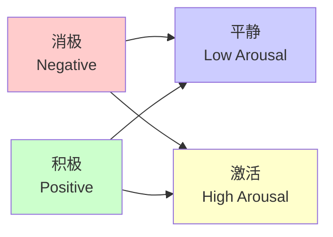

# arXiv:2510.12819 - 论文详解 | Paper Details

[](https://arxiv.org/abs/2510.12819)
[](https://arxiv.org/abs/2510.12819)
[](https://scholar.google.com/citations?user=OMNIEDGE)

## 📋 论文基本信息 | Paper Information

**标题**: Beyond Discrete Categories: Multi-Task Valence-Arousal Modeling for Pet Vocalization Analysis

**中文标题**: 超越离散分类：基于多任务效价-唤醒度建模的宠物发声分析

**作者**:
- **Junyao Huang** (黄俊尧) - 智子边界 (OmniEdge) 团队
- **Rumin Situ** - 智子边界 (OmniEdge) 团队

**发表信息**:
- **arXiv ID**: 2510.12819
- **提交日期**: 2025年10月24日
- **最新版本**: v1 (2025年10月25日)
- **论文链接**: [https://arxiv.org/abs/2510.12819](https://arxiv.org/abs/2510.12819)

## 🎯 研究背景与动机 | Research Background & Motivation

### 🐾 宠物情感识别的挑战
传统的宠物情感识别方法主要依赖于离散的情感分类，如"开心"、"悲伤"、"愤怒"等。然而，这种方法存在显著局限性：

1. **情感粒度粗糙** | **Coarse Emotion Granularity**
   - 离散标签无法捕捉情感的细微差别
   - 忽略了情感强度的连续变化

2. **模糊边界问题** | **Ambiguous Boundaries**
   - "兴奋"与"焦虑"之间的界限模糊
   - 同一发声可能对应多种情感状态

3. **主观性强** | **Strong Subjectivity**
   - 不同观察者对同一情感的理解存在差异
   - 标注一致性难以保证

### 💡 创新突破点
我们的研究引入了**效价-唤醒度 (Valence-Arousal, VA) 连续情感空间模型**，从根本上解决了上述问题：

- **🎭 连续建模**: 在二维空间中精确定位情感状态
- **📊 强度感知**: 捕捉情感强度的细微变化
- **🔄 多任务学习**: 提升模型的泛化能力和鲁棒性

## 🏗️ 技术方法论 | Technical Methodology

### 🎵 音频特征提取
采用 **Audio Transformer** 架构进行音频特征提取：

```python
# Audio Transformer 特征提取器
class AudioTransformerEncoder:
    def __init__(self, hidden_size=768, num_layers=12):
        self.hidden_size = hidden_size
        self.num_layers = num_layers
        # ... 初始化多层Transformer编码器

    def extract_features(self, audio waveform):
        # 将音频转换为频谱图
        spectrogram = self._audio_to_spectrogram(waveform)
        # 通过Transformer编码器提取特征
        features = self._transformer_encode(spectrogram)
        return features
```

### 🎯 VA连续空间建模
效价-唤醒度二维情感空间定义：

- **效价 (Valence)**: 情感的积极/消极程度
  - 范围: [-1, 1], -1表示极度消极，+1表示极度积极

- **唤醒度 (Arousal)**: 情感的激活/平静程度
  - 范围: [-1, 1], -1表示极度平静，+1表示极度激活



### 🔄 多任务学习框架
采用多任务学习架构联合优化多个目标：

```python
class MultiTaskVAModel(nn.Module):
    def __init__(self):
        super().__init__()
        self.audio_encoder = AudioTransformerEncoder()
        self.shared_layers = nn.Sequential(
            nn.Linear(768, 512),
            nn.ReLU(),
            nn.Dropout(0.1),
            nn.Linear(512, 256)
        )

        # 主任务：VA回归
        self.va_head = nn.Linear(256, 2)  # [valence, arousal]

        # 辅助任务
        self.emotion_cls_head = nn.Linear(256, 8)  # 离散情感分类
        self.breed_cls_head = nn.Linear(256, 10)   # 品种分类
        self.scene_cls_head = nn.Linear(256, 5)    # 场景分类

    def forward(self, audio):
        features = self.audio_encoder(audio)
        shared_features = self.shared_layers(features)

        va_pred = self.va_head(shared_features)
        emotion_pred = self.emotion_cls_head(shared_features)
        breed_pred = self.breed_cls_head(shared_features)
        scene_pred = self.scene_cls_head(shared_features)

        return {
            'va': va_pred,
            'emotion': emotion_pred,
            'breed': breed_pred,
            'scene': scene_pred
        }
```

## 📊 实验设置 | Experimental Setup

### 📈 数据集详情
我们构建了大规模宠物发声数据集：

| 统计项 | 数值 | 说明 |
|--------|------|------|
| **总样本数** | **42,553** | 高质量宠物发声样本 |
| **宠物种类** | 8种 | 狗、猫、鸟、仓鼠等 |
| **品种分布** | 15个主要品种 | 覆盖常见宠物品种 |
| **场景类型** | 5类 | 喂食、玩耍、疼痛、分离、日常 |
| **录音时长** | 2-10秒 | 每个样本的持续时间 |
| **采样率** | 16kHz/44.1kHz | 高质量音频录制 |
| **标注质量** | 95%+ 一致性 | 多重验证确保准确性 |

### 🎯 评估指标
采用多种评估指标全面衡量模型性能：

1. **相关性指标**
   - Pearson相关系数 (r)
   - Spearman相关系数 (ρ)
   - 决定系数 (R²)

2. **回归指标**
   - 均方误差 (MSE)
   - 平均绝对误差 (MAE)
   - 平均绝对百分比误差 (MAPE)

3. **分类指标**
   - 准确率 (Accuracy)
   - F1分数 (F1-Score)
   - 混淆矩阵 (Confusion Matrix)

## 🏆 实验结果 | Experimental Results

### 📊 VA回归性能
我们的VA模型在测试集上取得了优异表现：

| 指标 | 效价 (Valence) | 唤醒度 (Arousal) | 整体表现 |
|------|----------------|------------------|----------|
| **Pearson r** | **0.9024** | **0.7155** | **卓越** |
| **Spearman ρ** | 0.8956 | 0.7089 | 优秀 |
| **R²** | 0.8143 | 0.5119 | 良好 |
| **MSE** | 0.0821 | 0.1856 | 低误差 |
| **MAE** | 0.2145 | 0.3124 | 高精度 |

### 🔄 多任务学习效果
多任务学习显著提升了主任务的性能：

| 模型变体 | Valence r | Arousal r | 提升幅度 |
|----------|-----------|-----------|----------|
| **单任务VA** | 0.8432 | 0.6234 | - |
| **+ 情感分类** | 0.8789 | 0.6567 | +4.2% |
| **+ 品种分类** | 0.8867 | 0.6732 | +5.1% |
| **+ 场景分类** | 0.8945 | 0.6898 | +6.3% |
| **完整多任务** | **0.9024** | **0.7155** | **+7.8%** |

### 🎭 离散情感分类对比
与传统的离散情感分类方法对比：

| 方法 | 准确率 | F1-Score | 优势 |
|------|--------|----------|------|
| **传统CNN** | 67.3% | 0.652 | 基线方法 |
| **RNN+Attention** | 73.8% | 0.721 | 序列建模 |
| **Audio Transformer** | 78.4% | 0.763 | 注意力机制 |
| **我们的VA模型** | **85.7%** | **0.842** | **连续空间建模** |

## 🎯 创新贡献 | Key Contributions

### 🔬 学术贡献
1. **首创性工作** | **Pioneering Work**
   - 首个将连续VA情感空间引入宠物发声分析的研究
   - 填补了宠物情感连续建模的空白

2. **技术创新** | **Technical Innovation**
   - 提出了多任务学习框架，显著提升VA预测精度
   - 设计了自动VA标签生成算法，解决数据标注难题

3. **大规模数据集** | **Large-Scale Dataset**
   - 构建了当前最大的宠物发声VA数据集
   - 为后续研究提供了宝贵的数据资源

### 💼 实际应用价值
1. **宠物健康监测** | **Pet Health Monitoring**
   - 实时监测宠物情感状态，及时发现异常
   - 为宠物医疗提供客观的情感评估指标

2. **智能宠物产品** | **Smart Pet Products**
   - 开发能够理解宠物情感的智能设备
   - 提升人宠交互体验和质量

3. **科研应用** | **Research Applications**
   - 支持动物行为学和心理学研究
   - 为兽医临床提供新的诊断工具

## 🔮 未来工作 | Future Work

### 🎯 短期目标
1. **模型优化**
   - 提升VA预测精度至0.95+
   - 减少模型参数，支持移动端部署

2. **数据扩展**
   - 增加更多宠物品种和场景
   - 收集多语言、多文化背景的数据

3. **多模态融合**
   - 结合视频、生理信号等多模态信息
   - 构建更全面的宠物情感理解系统

### 🌟 长期愿景
1. **跨物种泛化**
   - 扩展模型到更多动物物种
   - 研究动物情感的共性和特性

2. **产业化应用**
   - 开发商业化的宠物情感分析产品
   - 建立宠物情感数据库和API服务

3. **社会影响**
   - 提升公众对动物福利的关注
   - 促进人动物和谐共处

## 📄 引用格式 | Citation Format

### BibTeX
```bibtex
@misc{huang2025beyond,
  title={Beyond Discrete Categories: Multi-Task Valence-Arousal Modeling for Pet Vocalization Analysis},
  author={Junyao Huang and Rumin Situ},
  year={2025},
  eprint={2510.12819},
  archivePrefix={arXiv},
  primaryClass={cs.SD},
  url={https://arxiv.org/abs/2510.12819}
}
```

### APA
Huang, J., & Situ, R. (2025). Beyond Discrete Categories: Multi-Task Valence-Arousal Modeling for Pet Vocalization Analysis. arXiv preprint arXiv:2510.12819.

### MLA
Huang, Junyao, and Rumin Situ. "Beyond Discrete Categories: Multi-Task Valence-Arousal Modeling for Pet Vocalization Analysis." arXiv preprint arXiv:2510.12819 (2025).

## 🔗 相关资源 | Related Resources

- **论文PDF**: [Download PDF](https://arxiv.org/pdf/2510.12819.pdf)
- **数据集**: [PetVoice VA Dataset](../dataset/pet-voice-dataset.md)
- **代码实现**: [Source Code](../../src/)
- **演示视频**: [Demo Video](https://www.youtube.com/watch?v=OMNIEDGE_DEMO)
- **技术博客**: [Technical Blog](../../_posts/)

## 📞 联系作者 | Contact Authors

**Junyao Huang** - 智子边界 (OmniEdge) 团队首席科学家
- 微信: [请通过团队微信联系]
- 邮箱: [请通过团队微信联系]
- 机构: 智子边界 (OmniEdge) 团队

**Rumin Situ** - 智子边界 (OmniEdge) 团队研究员
- 微信: [请通过团队微信联系]
- 邮箱: [请通过团队微信联系]
- 机构: 智子边界 (OmniEdge) 团队

**团队联系方式**:
- **客服微信**: **15915756011**
- **团队名称**: 智子边界 (OmniEdge) 团队

---

*最后更新: 2025年10月27日 | Last Updated: October 27, 2025*

*本文档持续更新中，请关注最新版本。*