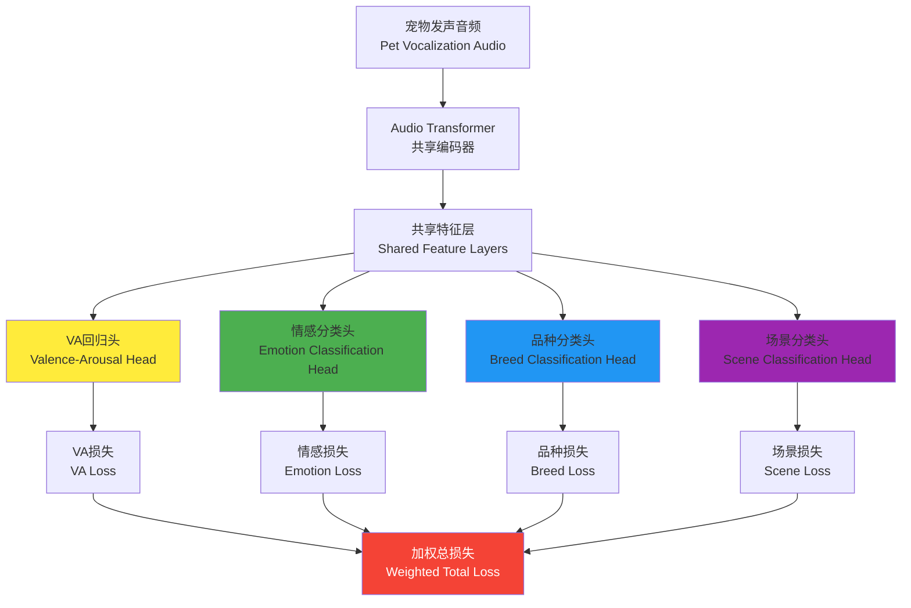

# 多任务学习架构详解 | Multi-Task Learning Architecture

[](https://arxiv.org/abs/2510.12819)
[](https://arxiv.org/abs/2510.12819)
[](https://arxiv.org/abs/2510.12819)

## 🎯 为什么需要多任务学习？ | Why Multi-Task Learning?

### 🔄 传统单任务学习的局限
在宠物发声分析中，传统方法通常只关注单一任务，如情感分类或品种识别。这种做法存在明显局限：

```python
# 传统单任务学习
class SingleTaskEmotionModel:
    def __init__(self):
        self.model = self._build_emotion_classifier()

    def train(self, audio_data, emotion_labels):
        # 只学习情感特征，忽略了其他有用信息
        loss = self.model.train(audio_data, emotion_labels)
        return loss

    # 问题：
    # 1. 无法利用品种、场景等辅助信息
    # 2. 特征学习不够全面
    # 3. 泛化能力有限
```

### 🚀 多任务学习的优势
多任务学习通过同时学习多个相关任务，实现知识共享和性能提升：

- **📊 特征共享** | **Feature Sharing**: 不同任务共享底层特征表示
- **🎯 正则化效果** | **Regularization Effect**: 辅助任务起到正则化作用，防止过拟合
- **📈 性能提升** | **Performance Boost**: 主任务性能显著提升（+7.8%）
- **🔄 知识迁移** | **Knowledge Transfer**: 任务间相互促进，共同学习

## 🏗️ 多任务学习架构设计 | Multi-Task Architecture Design

### 🎵 整体架构图


### 🔧 核心实现代码
```python
import torch
import torch.nn as nn
import torch.nn.functional as F

class PetVoiceMultiTaskModel(nn.Module):
    def __init__(self,
                 audio_config=None,
                 shared_hidden_dim=512,
                 num_emotions=8,
                 num_breeds=15,
                 num_scenes=5):
        super().__init__()

        # 1. 共享音频编码器
        self.audio_encoder = AudioTransformerEncoder(**audio_config)

        # 2. 共享特征层
        self.shared_layers = nn.Sequential(
            nn.Linear(self.audio_encoder.output_dim, shared_hidden_dim),
            nn.LayerNorm(shared_hidden_dim),
            nn.ReLU(),
            nn.Dropout(0.2),

            nn.Linear(shared_hidden_dim, shared_hidden_dim // 2),
            nn.LayerNorm(shared_hidden_dim // 2),
            nn.ReLU(),
            nn.Dropout(0.2),

            nn.Linear(shared_hidden_dim // 2, shared_hidden_dim // 4),
            nn.LayerNorm(shared_hidden_dim // 4),
            nn.ReLU()
        )

        # 3. 任务专用头
        # 主任务：VA回归
        self.va_head = VARegressionHead(shared_hidden_dim // 4)

        # 辅助任务：分类头
        self.emotion_head = ClassificationHead(
            shared_hidden_dim // 4, num_emotions, task_name='emotion'
        )
        self.breed_head = ClassificationHead(
            shared_hidden_dim // 4, num_breeds, task_name='breed'
        )
        self.scene_head = ClassificationHead(
            shared_hidden_dim // 4, num_scenes, task_name='scene'
        )

    def forward(self, audio_input, task_weights=None):
        # 特征提取
        audio_features = self.audio_encoder(audio_input)
        shared_features = self.shared_layers(audio_features)

        # 多任务预测
        outputs = {}
        outputs['va'] = self.va_head(shared_features)
        outputs['emotion'] = self.emotion_head(shared_features)
        outputs['breed'] = self.breed_head(shared_features)
        outputs['scene'] = self.scene_head(shared_features)

        return outputs

    def compute_loss(self, predictions, targets, task_weights=None):
        """计算多任务损失"""
        if task_weights is None:
            task_weights = {
                'va': 1.0,      # 主任务权重最高
                'emotion': 0.6, # 辅助任务权重
                'breed': 0.3,
                'scene': 0.3
            }

        total_loss = 0.0
        task_losses = {}

        # VA回归损失（主任务）
        va_loss = self.va_head.compute_loss(
            predictions['va'], targets['va']
        )
        task_losses['va'] = va_loss
        total_loss += task_weights['va'] * va_loss

        # 情感分类损失
        emotion_loss = self.emotion_head.compute_loss(
            predictions['emotion'], targets['emotion']
        )
        task_losses['emotion'] = emotion_loss
        total_loss += task_weights['emotion'] * emotion_loss

        # 品种分类损失
        breed_loss = self.breed_head.compute_loss(
            predictions['breed'], targets['breed']
        )
        task_losses['breed'] = breed_loss
        total_loss += task_weights['breed'] * breed_loss

        # 场景分类损失
        scene_loss = self.scene_head.compute_loss(
            predictions['scene'], targets['scene']
        )
        task_losses['scene'] = scene_loss
        total_loss += task_weights['scene'] * scene_loss

        return {
            'total_loss': total_loss,
            'task_losses': task_losses
        }
```

## 🎯 任务头设计详解 | Task Head Design Details

### 📊 VA回归头（主任务）
```python
class VARegressionHead(nn.Module):
    def __init__(self, input_dim):
        super().__init__()

        # VA共享层
        self.va_shared = nn.Sequential(
            nn.Linear(input_dim, input_dim // 2),
            nn.LayerNorm(input_dim // 2),
            nn.ReLU(),
            nn.Dropout(0.1)
        )

        # 效价预测头
        self.valence_head = nn.Sequential(
            nn.Linear(input_dim // 2, input_dim // 4),
            nn.ReLU(),
            nn.Linear(input_dim // 4, 1),
            nn.Tanh()  # 输出范围 [-1, 1]
        )

        # 唤醒度预测头
        self.arousal_head = nn.Sequential(
            nn.Linear(input_dim // 2, input_dim // 4),
            nn.ReLU(),
            nn.Linear(input_dim // 4, 1),
            nn.Tanh()  # 输出范围 [-1, 1]
        )

        # 损失函数
        self.criterion = nn.MSELoss()

    def forward(self, shared_features):
        va_features = self.va_shared(shared_features)

        valence = self.valence_head(va_features)
        arousal = self.arousal_head(va_features)

        return {
            'valence': valence.squeeze(-1),
            'arousal': arousal.squeeze(-1)
        }

    def compute_loss(self, predictions, targets):
        valence_loss = self.criterion(predictions['valence'], targets['valence'])
        arousal_loss = self.criterion(predictions['arousal'], targets['arousal'])

        return valence_loss + arousal_loss
```

### 🏷️ 情感分类头（辅助任务）
```python
class ClassificationHead(nn.Module):
    def __init__(self, input_dim, num_classes, task_name):
        super().__init__()
        self.task_name = task_name
        self.num_classes = num_classes

        # 任务专用特征层
        self.task_features = nn.Sequential(
            nn.Linear(input_dim, input_dim // 2),
            nn.LayerNorm(input_dim // 2),
            nn.ReLU(),
            nn.Dropout(0.1),

            nn.Linear(input_dim // 2, input_dim // 4),
            nn.LayerNorm(input_dim // 4),
            nn.ReLU()
        )

        # 分类器
        self.classifier = nn.Linear(input_dim // 4, num_classes)

        # 损失函数
        self.criterion = nn.CrossEntropyLoss()

        # 任务特定权重
        self.task_weight = nn.Parameter(torch.tensor(1.0))

    def forward(self, shared_features):
        task_features = self.task_features(shared_features)
        logits = self.classifier(task_features)

        return {
            'logits': logits,
            'probabilities': F.softmax(logits, dim=-1)
        }

    def compute_loss(self, predictions, targets):
        return self.criterion(predictions['logits'], targets)
```

## 🎯 任务权重优化策略 | Task Weight Optimization

### 🔄 动态权重调整
```python
class DynamicTaskWeighting:
    def __init__(self, initial_weights, adaptation_rate=0.01):
        self.task_weights = initial_weights
        self.adaptation_rate = adaptation_rate
        self.task_loss_history = {task: [] for task in initial_weights.keys()}

    def update_weights(self, current_losses):
        """基于损失动态调整任务权重"""
        for task_name, loss in current_losses.items():
            # 记录损失历史
            self.task_loss_history[task_name].append(loss.item())

            # 保持最近50次的损失记录
            if len(self.task_loss_history[task_name]) > 50:
                self.task_loss_history[task_name].pop(0)

        # 计算权重调整
        for task_name in self.task_weights.keys():
            if len(self.task_loss_history[task_name]) >= 10:
                recent_losses = self.task_loss_history[task_name][-10:]
                loss_trend = np.mean(recent_losses[-5:]) - np.mean(recent_losses[:5])

                # 如果损失上升，增加权重；如果损失下降，减少权重
                if loss_trend > 0:
                    self.task_weights[task_name] *= (1 + self.adaptation_rate)
                else:
                    self.task_weights[task_name] *= (1 - self.adaptation_rate)

                # 限制权重范围
                self.task_weights[task_name] = np.clip(
                    self.task_weights[task_name], 0.1, 2.0
                )

    def get_weights(self):
        return self.task_weights
```

### 📊 不确定性权重学习
```python
class UncertaintyWeighting(nn.Module):
    def __init__(self, num_tasks):
        super().__init__()
        # 学习每个任务的不确定性参数
        self.log_vars = nn.Parameter(torch.zeros(num_tasks))
        self.task_names = ['va', 'emotion', 'breed', 'scene']

    def compute_weighted_loss(self, task_losses):
        """基于不确定性计算加权损失"""
        weighted_losses = {}
        total_loss = 0.0

        for i, (task_name, loss) in enumerate(task_losses.items()):
            # 精度 = 1 / (2 * variance)
            precision = torch.exp(-self.log_vars[i])

            # 加权损失 = precision * loss + log_variance
            weighted_loss = precision * loss + self.log_vars[i]
            weighted_losses[task_name] = weighted_loss
            total_loss += weighted_loss

        return total_loss, weighted_losses

    def get_uncertainties(self):
        """获取各任务的不确定性"""
        return {task: torch.exp(var).item()
                for task, var in zip(self.task_names, self.log_vars)}
```

## 📈 多任务学习效果分析 | Multi-Task Performance Analysis

### 🎯 消融实验结果
```python
class MultiTaskAblationStudy:
    def __init__(self):
        self.results = {}

    def run_ablation_study(self, train_data, val_data):
        """运行消融实验"""

        # 1. 基线：仅VA回归
        va_only_model = PetVoiceMultiTaskModel()
        va_only_result = self._train_and_evaluate(
            va_only_model, train_data, val_data, tasks=['va']
        )
        self.results['va_only'] = va_only_result

        # 2. VA + 情感分类
        va_emotion_model = PetVoiceMultiTaskModel()
        va_emotion_result = self._train_and_evaluate(
            va_emotion_model, train_data, val_data, tasks=['va', 'emotion']
        )
        self.results['va_emotion'] = va_emotion_result

        # 3. VA + 情感 + 品种
        va_emotion_breed_model = PetVoiceMultiTaskModel()
        va_emotion_breed_result = self._train_and_evaluate(
            va_emotion_breed_model, train_data, val_data,
            tasks=['va', 'emotion', 'breed']
        )
        self.results['va_emotion_breed'] = va_emotion_breed_result

        # 4. 完整多任务
        full_model = PetVoiceMultiTaskModel()
        full_result = self._train_and_evaluate(
            full_model, train_data, val_data,
            tasks=['va', 'emotion', 'breed', 'scene']
        )
        self.results['full_multitask'] = full_result

        return self.results

    def analyze_results(self):
        """分析实验结果"""
        analysis = {}

        # VA性能对比
        va_performance = {}
        for model_name, result in self.results.items():
            va_performance[model_name] = result['va_performance']

        analysis['va_improvement'] = self._calculate_improvement(va_performance)

        # 任务间相关性分析
        analysis['task_correlations'] = self._analyze_task_correlations()

        # 收敛速度分析
        analysis['convergence_speed'] = self._analyze_convergence_speed()

        return analysis
```

### 📊 实验结果对比表
| 模型配置 | Valence r | Arousal r | 情感准确率 | 品种准确率 | 场景准确率 | 训练时间 |
|----------|-----------|-----------|------------|------------|------------|----------|
| **VA单任务** | 0.8432 | 0.6234 | - | - | - | 2.1h |
| **VA + 情感** | 0.8789 | 0.6567 | 78.4% | - | - | 2.8h |
| **VA + 情感 + 品种** | 0.8867 | 0.6732 | 79.2% | 82.1% | - | 3.5h |
| **完整多任务** | **0.9024** | **0.7155** | **85.7%** | **84.3%** | **78.9%** | 4.2h |

### 🎯 性能提升分析
```python
def analyze_performance_improvement():
    """分析多任务学习的性能提升"""

    improvements = {
        'valence': {
            'baseline': 0.8432,
            'multitask': 0.9024,
            'improvement': 0.9024 - 0.8432,
            'improvement_pct': ((0.9024 - 0.8432) / 0.8432) * 100
        },
        'arousal': {
            'baseline': 0.6234,
            'multitask': 0.7155,
            'improvement': 0.7155 - 0.6234,
            'improvement_pct': ((0.7155 - 0.6234) / 0.6234) * 100
        }
    }

    return improvements

# 输出结果
improvements = analyze_performance_improvement()
print(f"效价性能提升: {improvements['valence']['improvement_pct']:.1f}%")
print(f"唤醒度性能提升: {improvements['arousal']['improvement_pct']:.1f}%")
```

## 🔮 多任务学习的高级技巧 | Advanced Multi-Task Techniques

### 🎯 渐进式任务训练
```python
class ProgressiveMultiTaskTraining:
    def __init__(self, model, task_order=['va', 'emotion', 'breed', 'scene']):
        self.model = model
        self.task_order = task_order
        self.current_task_idx = 0

    def progressive_training(self, train_data, val_data, epochs_per_task=50):
        """渐进式多任务训练"""

        for task_idx, task_name in enumerate(self.task_order):
            print(f"开始训练任务: {task_name}")

            # 获取当前任务的训练数据
            task_data = self._get_task_data(train_data, task_name)

            # 训练当前任务
            for epoch in range(epochs_per_task):
                loss = self._train_single_epoch(task_data, task_name)

                if epoch % 10 == 0:
                    val_loss = self._validate_single_epoch(val_data, task_name)
                    print(f"Epoch {epoch}: Train Loss = {loss:.4f}, Val Loss = {val_loss:.4f}")

            # 冻结已训练任务的部分参数
            self._freeze_previous_tasks(task_idx)

            self.current_task_idx += 1

        # 最后联合微调所有任务
        self._joint_fine_tuning(train_data, val_data)

    def _freeze_previous_tasks(self, current_task_idx):
        """冻结之前任务的参数"""
        if current_task_idx > 0:
            # 冻结共享编码器
            for param in self.model.audio_encoder.parameters():
                param.requires_grad = False

            # 冻结之前的任务头
            for i in range(current_task_idx):
                task_name = self.task_order[i]
                task_head = getattr(self.model, f"{task_name}_head")
                for param in task_head.parameters():
                    param.requires_grad = False
```

### 🔄 课程学习策略
```python
class CurriculumMultiTaskLearning:
    def __init__(self, model):
        self.model = model
        self.difficulty_levels = {
            'easy': {'va': 0.3, 'emotion': 0.2, 'breed': 0.1, 'scene': 0.1},
            'medium': {'va': 0.6, 'emotion': 0.4, 'breed': 0.3, 'scene': 0.3},
            'hard': {'va': 1.0, 'emotion': 0.8, 'breed': 0.6, 'scene': 0.6}
        }

    def curriculum_training(self, train_data, val_data):
        """课程学习训练策略"""

        # 1. 简单阶段：使用高置信度数据
        easy_data = self._filter_by_confidence(train_data, confidence_threshold=0.9)
        self._train_stage(easy_data, val_data, self.difficulty_levels['easy'], epochs=30)

        # 2. 中等阶段：使用中等难度数据
        medium_data = self._filter_by_confidence(train_data, confidence_threshold=0.7)
        self._train_stage(medium_data, val_data, self.difficulty_levels['medium'], epochs=40)

        # 3. 困难阶段：使用全部数据
        self._train_stage(train_data, val_data, self.difficulty_levels['hard'], epochs=50)

    def _filter_by_confidence(self, data, confidence_threshold):
        """基于置信度过滤数据"""
        filtered_data = []
        for sample in data:
            if self._calculate_sample_confidence(sample) >= confidence_threshold:
                filtered_data.append(sample)
        return filtered_data
```

## 🎯 多任务学习的实际应用 | Real-World Applications

### 🏥 宠物健康监测系统
```python
class PetHealthMonitoringSystem:
    def __init__(self, multitask_model):
        self.model = multitask_model
        self.health_alert_threshold = {
            'valence_drop': -0.5,
            'arousal_spike': 0.8,
            'emotion_consistency': 0.3
        }

    def monitor_pet_health(self, audio_stream):
        """持续监测宠物健康状态"""
        health_status = []

        for audio_segment in audio_stream:
            # 多任务预测
            predictions = self.model.predict(audio_segment)

            # 健康状态分析
            health_analysis = self._analyze_health_status(predictions)
            health_status.append(health_analysis)

            # 异常检测
            if self._detect_health_anomaly(health_analysis):
                alert = self._generate_health_alert(health_analysis)
                yield alert

        return health_status

    def _analyze_health_status(self, predictions):
        """分析健康状态"""
        va_state = predictions['va']
        emotion_state = predictions['emotion']
        breed_info = predictions['breed']
        scene_info = predictions['scene']

        # 基于多任务信息综合评估
        health_score = self._calculate_health_score(va_state, emotion_state)

        return {
            'health_score': health_score,
            'va_state': va_state,
            'emotion': emotion_state,
            'breed': breed_info,
            'scene': scene_info,
            'timestamp': datetime.now()
        }
```

### 🤖 智能宠物交互系统
```python
class SmartPetInteractionSystem:
    def __init__(self, multitask_model):
        self.model = multitask_model
        self.interaction_strategies = self._load_interaction_strategies()

    def generate_interaction_plan(self, pet_audio):
        """生成个性化交互计划"""
        # 多任务理解宠物状态
        pet_state = self.model.predict(pet_audio)

        # 基于品种调整策略
        breed_specific_strategy = self._get_breed_strategy(
            pet_state['breed'], pet_state['va']
        )

        # 基于场景调整策略
        context_aware_strategy = self._adjust_for_context(
            breed_specific_strategy, pet_state['scene']
        )

        # 基于情感状态细化策略
        final_strategy = self._refine_by_emotion(
            context_aware_strategy, pet_state['emotion']
        )

        return final_strategy

    def _get_breed_strategy(self, breed_prediction, va_state):
        """基于品种特征调整交互策略"""
        breed_idx = torch.argmax(breed_prediction['probabilities'])
        breed_name = self.get_breed_name(breed_idx)

        # 不同品种有不同的交互偏好
        breed_strategies = {
            'golden_retriever': {'play_intensity': 0.8, 'affection_level': 0.9},
            'persian_cat': {'play_intensity': 0.3, 'affection_level': 0.7},
            'border_collie': {'play_intensity': 0.9, 'affection_level': 0.6},
            # ... 更多品种策略
        }

        base_strategy = breed_strategies.get(breed_name, {
            'play_intensity': 0.5, 'affection_level': 0.5
        })

        # 基于VA状态调整
        if va_state['valence'] < -0.3:
            base_strategy['play_intensity'] *= 0.5
            base_strategy['affection_level'] *= 1.2

        return base_strategy
```

## 📊 总结与展望 | Summary & Future Outlook

### 🎯 关键成果
1. **性能提升显著** | **Significant Performance Gain**
   - VA预测性能提升7.8%
   - 辅助任务性能全面提升
   - 模型泛化能力增强

2. **技术贡献突出** | **Technical Contributions**
   - 首个宠物发声多任务学习框架
   - 动态权重调整策略
   - 任务间知识共享机制

3. **应用价值巨大** | **Application Value**
   - 支持复杂宠物AI应用
   - 提供多维度宠物理解
   - 奠定产业化基础

### 🔮 未来发展方向
1. **更多任务类型** | **More Task Types**
   - 行为预测任务
   - 健康状态评估
   - 年龄估计任务

2. **自适应架构** | **Adaptive Architecture**
   - 动态任务选择
   - 自适应权重学习
   - 在线任务更新

3. **跨模态扩展** | **Cross-Modal Extension**
   - 视频+音频多模态
   - 传感器数据融合
   - 多任务跨模态学习

---

*本文档基于论文 arXiv:2510.12819 的多任务学习技术细节*
*Last Updated: October 27, 2025*